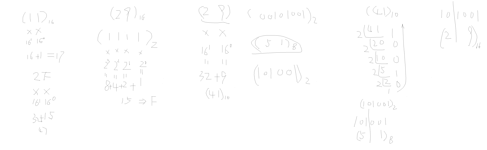

# day01

## 编码规范

 工具不建议汉化

 跟项目相关的内容不要放在含有中文和特殊符号的目录

 Java方面的编码规范

 - Pascal命名法，每个单词的首字母均大写
   - 一般用于类名，接口名，枚举类名，注解类名
   - 示例：HelloWorld， BubbleSort，SelectionSort
 - 驼峰命名法：每个单词，第一个单词首字母小写，后面的所有单词首字母均大写
   - 一般用于方法名，变量名
   - 示例：showDetail, money, userName
 - 匈牙利命名法:给单词前面或者后面添加一些前缀或者后缀
   - 一般用于控件命名
   - 示例：btnRegistry, txtUserName, lblPassword
 - 全大写：每个字母均大写，如果是多个单词，单词与单词之间使用下划线拼接
   - 一般用于常量名
   - 示例MAX_VALUE, MALE
 - 全小写：每个单词均小写
   - 一般用于包名
   - 示例：com.baidu, edu.shanxi

## 辅助工具

 chatgpt

 文心一言

 豆包

 groq

<<<<<<< HEAD
 ---

=======
>>>>>>> be2f14f (correct)
java 的数据类型

 分类：

 - 基本类型
   - 数值型：byte，short， int， long
   - 浮点型：float， double
   - 逻辑型：boolean
   - 字符型：char
 - 引用类型
   - 所有的系统定义的类和用户自定义的类
   - String
   - 八种基本类型的数组

## 基础内容

 需求，开发，测试，运维
 ```java
 package edu.shanxi;
 
 public class Test01 {
 
     public static void main(String[] args) {
         char ch = 'A';
 
         System.out.println(ch);
 
         char ch2 = '中';         //  java是双字节的计算机语言，所以一个中文占两个字节是可以被存放在一个char中的
         System.out.println(ch2);
 
         char ch3 = ' ';         //  java中的字符只能存放一个字符，所以一个空格只能存放在char中，两个或者两个以上都不能存放在char中
         System.out.println(ch3);
 
         char ch4 = '\u4e2d';    // \u开头的为16进制的unicode码
         System.out.println(ch4);
 
         char ch5 = '\'';        //  \在Java中代表转义字符，所以\'代表一个单引号，而\"代表一个双引号，\代表转义符，换行符为\n，\r代表回车符，\t代表制表符，\b代表退格符
         System.out.println(ch5);
 
         char ch6 = '\\';
         System.out.println(ch6);
 
         char ch7 = '\u597d';
         System.out.println(ch7);
     }
 }
 ```

 ```java
 package edu.shanxi;
 
 public class Test02 {
 
     public static void main(String[] args) {
         char c = 100;       //  将整数赋值给char类型的变量，会自动将100转换为对应的字符
         System.out.println(c);
 
         int i = 'a';        //  将字符赋值给int类型的变量，会自动将字符a转换为对应的整数
         System.out.println(i);
 
         int ii = i + c;     //  char类型的变量与int类型的变量相加，会自动将char类型的变量转换为对应的整数相加
         System.out.println(ii);
     }
 }
 ```

 ```java
 package edu.shanxi;
 
 public class Test03 {
 
     public static void main(String[] args) {
         int i = 1, j = 3;
 //        System.out.println(i +++++ j);          //  编译报错，编译器不知道该如何“断句”
 //        System.out.println(i ++ + ++ j);          //    1+4
         System.out.println(i + + + + + j);          //  第一个加号代表加法运算，后面的加号代表的是符号位运算
 //        System.out.println(1 ++ +  ++3);            //  i++代表的是i= i+ 1； 而++i代表的是i= i+1， 1++ 代表的是1=1+1，结论，常量不能进行自增自减的运算
     }
 }
 ```

 ```java
 package edu.shanxi;
 
 public class Test04 {
 
     public static void main(String[] args) {
         int i = 1, j = 2;
 
         System.out.println(i / j);              //  java中整数与整数的运算，结果只能是整数，所以结果是0
         System.out.println((double)(i / j));    //  这个运算是将整数i于j运算的结果提升为double类型，最终结果为0.0
         System.out.println((double) i / j);     //  这个运算是将i提升为double类型，再与j运算，最终结果为0.5
     }
 }
 ```

 ```java
 package edu.shanxi;
 
 public class Test05 {
 
     public static void main(String[] args) {
         int num = 11;
         int num1 = 011;     //  整数前面加零代表八进制
         int num2 = 0x11;    //  整数前面加0x/0X代表十六进制
         int num3 = 0b11;    //  整数前面加0b/0B代表二进制
 
         System.out.println(num);
         System.out.println(num1);
         System.out.println(num2);
         System.out.println(num3);
     }
 }
 ```

<<<<<<< HEAD
 
=======
 
>>>>>>> be2f14f (correct)

 ```java
 package edu.shanxi;
 
 public class Test06 {
     public static void main(String[] args) {
 
         int i = 10;
 
         i = i + 20;
 
         System.out.println(i);
 
         int j = 10;
 
         j += 20;        //  j += 20，等同于 j = j + 20，会更精简一些
 
         System.out.println(j);
 
         int k = 10;
 
 //        k = (int)(k + 9.9);
         k += 9.9;       //  复合赋值运算符可以进行自动类型转换
 
         System.out.println(k);
     }
 }
 ```

 ```java
 package edu.shanxi;
 
 /**
  * java中有四种级别的访问修饰符public、protected、default、private
  * public 修饰的类、属性、方法、变量都可以在本项目任意位置被访问
  * protected 修饰的类、属性、方法、变量只能在本包及其子类中被访问
  * default 修饰的类、属性、方法、变量只能在本包中被访问
  * private 修饰的类、属性、方法、变量只能在本类中被访问
  */
 
 public class Test07 {
     public static void main(String[] args)
     {
         Animal animal = new Animal();
         animal.eat();
         animal.sleep();
 
         System.out.println("============");
 
         Sheep sheep = new Sheep();
         sheep.eat();
         sheep.sleep();
 
         System.out.println("============");
 
         Wolf wolf = new Wolf();
         wolf.eat();
         wolf.sleep();
 
         System.out.println("+++++++++++++");
 
         int i = (int)9.9;        //  double类型的变量是不能直接赋值给int类型的变量的，需要先将double类型的变量转换为int类型
         double d = 9;            //  int类型的变量可以直接赋值给double类型的变量的，不需要进行类型转换,但是赋值后，double类型的变量 lose precision (精度丢失)
 
         Animal ani = new Sheep();
 //        Sheep sa = (Sheep) new Animal();
 
         Animal as = sheep;
         as.eat();
 
         System.out.println("============");
 
         if (as instanceof Wolf){
 
             Wolf wa = (Wolf)as;
             wa.eat();
         }
     }
 }
 
 class Animal{
     public void eat(){
         System.out.println("eat");
     }
 
     protected void sleep(){
         System.out.println("sleep");
         System.out.println("zzzZZZ");
     }
 }
 
 class Sheep extends Animal{
 
     public void eat(){
         System.out.println("sheep likes grass");
         super.eat();
     }
 }
 
 class Wolf extends Animal{
 
     public void eat(){
         System.out.println("wolf likes sheep");
         super.eat();
     }
 }
 ```

 Java中的封装、继承、多态

 子类类型的对象赋值给父类类型的变量

 该变量可以调用该变量对应的子父类中共有的方法，不能调用子类所特有的方法。

